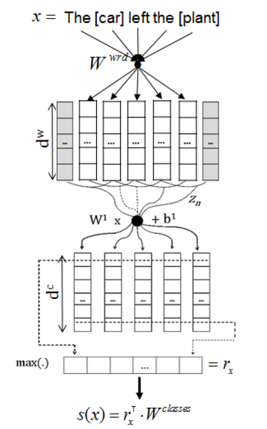

# CR-CNN

## The code for Classifying Relations by Ranking with Convolutional Neural Networks

### 模型结构

### 项目环境配置

* Python3.8
* jupyter notebook
* torch           1.6.0+cu10.2
* numpy           1.18.5
